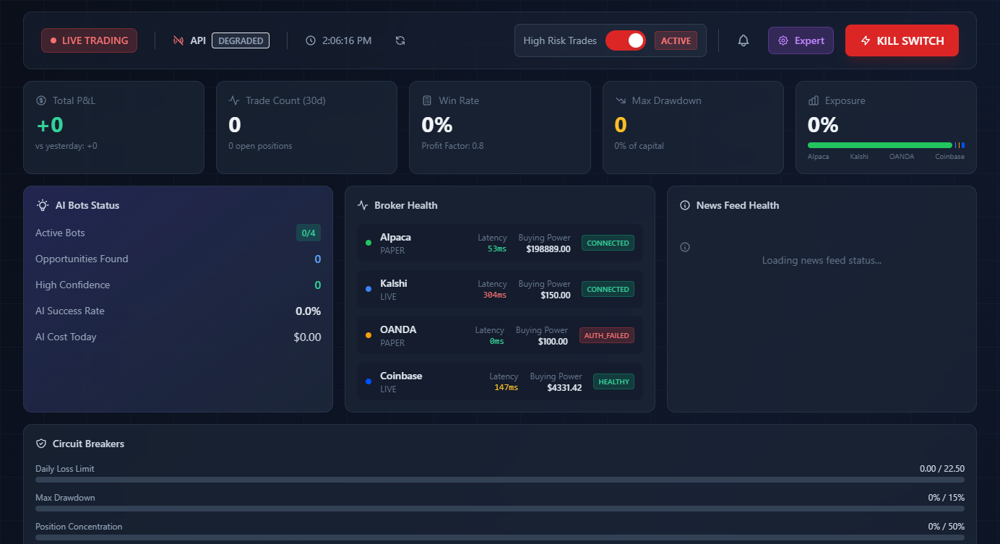
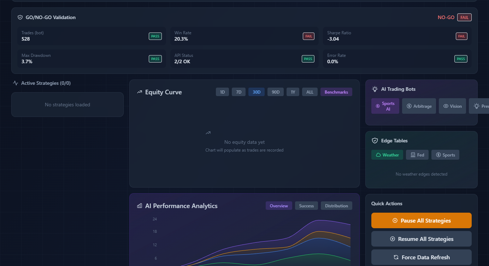

# Algorithmic Trading Platform

A production multi-asset algorithmic trading system running live since January 2026. A central orchestrator manages 50+ independent trading bots across crypto, forex, and prediction markets, with AI-powered signal filtering, ensemble ML models, and automated risk management.

**Scale**: ~159,000 lines of Python across 400+ files. Five asset classes. Six broker integrations. 15+ data scrapers. Real capital at risk.

---

## Dashboard

Real-time monitoring dashboard with broker health, circuit breakers, AI bot status, and risk controls.





---

## What Makes This Interesting

- **8-source prediction market pipeline** that routes weather tickers to meteorological models (GFS 30-member ensemble, NWS Normal CDF) and economic tickers to Fed nowcasts (Cleveland CPI, Atlanta GDPNow) -- domain-specific intelligence, not generic sentiment.
- **Thompson sampling meta-controller** dynamically reallocates capital across 19 sub-bots because strategy performance is non-stationary. Static allocation decays; adaptive allocation compounds.
- **3-gate entry system** (edge threshold, ML model, price intelligence) born from a 0-for-49 losing streak that forced a full pipeline rebuild. Every gate exists because removing it costs money.
- **HMM regime detection** classifies markets as bull/bear/sideways and adjusts position sizing system-wide. Strategies that work in trends get throttled in mean-reverting regimes, and vice versa.
- **LLM veto layer** where every trade signal is reviewed by an AI before execution. Not a novelty -- it catches category errors that quantitative filters miss (e.g., stale data, event timing conflicts).

---

## Architecture

```
start.ps1
  └── master_orchestrator.py (4,445 LOC)
        ├── BOT_REGISTRY (50+ bots)
        │     ├── Per-bot scheduling (10s to daily intervals, timezone-aware)
        │     ├── Regime detection filter (HMM: bull / bear / sideways)
        │     └── AI veto layer (LLM reviews every signal)
        │
        ├── Risk Engine
        │     ├── Kelly Criterion (Quarter-Kelly) + Hierarchical Risk Parity
        │     ├── VaR / CVaR calculations
        │     ├── Daily loss limits with automatic trading halt
        │     ├── Correlation-based exposure limits
        │     └── Contradictory position detection
        │
        ├── Execution
        │     ├── Paper or live routing
        │     ├── Broker abstraction (Alpaca, OANDA, Kalshi, Polymarket, Coinbase)
        │     └── 3-tier scaled exits (33% at 1R, 33% at 2R, 34% trailing 1.5 ATR)
        │
        └── Monitoring
              ├── SQLite persistence
              ├── Flask dashboard (real-time P&L, bot status)
              └── Telegram alerts (trades, daily summaries, remote control)
```

---

## Core Systems

### 1. Multi-Asset Trading Engine

The central orchestrator manages the full lifecycle of 50+ trading bots -- scheduling, signal generation, risk checks, execution, and reconciliation.

| Capability | Detail |
|---|---|
| Asset classes | Stocks, crypto, forex, prediction markets (Kalshi + Polymarket) |
| Broker integrations | Alpaca (stocks/crypto), OANDA (forex), Kalshi, Polymarket, Coinbase, CCXT |
| Scheduling | Per-bot intervals from 10 seconds to daily, timezone-aware triggers |
| Execution modes | Paper trading with full simulation, live with broker APIs |
| Orchestrator size | 4,445 LOC -- handles registration, scheduling, filtering, risk, execution, monitoring |

### 2. Prediction Market Intelligence

An 8-source edge detection system with domain-specific routing. Weather tickers hit meteorological models. Economic tickers hit Fed nowcasts. Sports tickers hit odds APIs. No source is used outside its domain of competence.

| Source | Domain | Method |
|---|---|---|
| GFS Ensemble | Weather | 30-member ensemble, probability = fraction exceeding threshold |
| NWS Forecast | Weather | Normal CDF with 3-degree-F error band, city/threshold parsed from ticker |
| Cleveland Fed | Economics | CPI MoM nowcast scrape, 0.10pp error band |
| Atlanta Fed GDPNow | Economics | FRED API, 0.8pp error band |
| FRED Data | Economics | Federal Reserve Economic Data API |
| Whale Tracker | All | Large-order flow analysis, dampened to prevent manipulation |
| News Sentiment | All | FinBERT + multi-source caching, 100/day API budget management |
| Sportsbook Odds | Sports | Cross-book consensus via OddsAPI |

**Entry controls**: Consensus engine requires 2+ independent sources. Price intelligence gates on VWAP, drift, and spikes. Hard cap at 30 cents entry price. 30-minute re-entry cooldown.

### 3. AI/ML Pipeline

An 8-source signal ensemble where each source contributes a weighted vote to the final trading decision.

| Source | Weight | Role |
|---|---|---|
| ML Model (XGBoost) | 20% | Per-asset trained models (BTC, ETH, SOL), weekly retraining |
| Market Analyst (LLM) | 15% | Claude/OpenAI-powered qualitative analysis |
| Multi-Timeframe | 15% | Cross-timeframe signal alignment |
| Bot Consensus | 10% | Agreement signal across active bots |
| Technical | 10% | Classical indicators (RSI, MACD, Bollinger) |
| Crypto Derivatives | 10% | Funding rates (CCXT/Bybit), liquidation levels |
| Macro | 10% | Cross-asset correlation, regime context |
| News | 5% | FinBERT sentiment on aggregated feeds |

Additional ML components:
- **HMM Regime Detection**: Hidden Markov Model classifies market state; all position sizing adjusts accordingly.
- **XGBoost per-asset models**: Trained on engineered features, retrained weekly via automated pipeline.
- **FinBERT sentiment**: Transformer-based sentiment scoring on financial news.
- **LLM veto layer**: Every signal reviewed by AI before execution. Catches category errors quantitative filters miss.

### 4. Fleet System (19-Bot Meta-Controller)

A meta-controller managing 19 sub-bots across 4 asset classes, using Thompson sampling to dynamically allocate capital to strategies based on live performance.

| Asset Class | Bots | Notable Strategies |
|---|---|---|
| Crypto | 10 | Grid Trader (HMM sideways gate), Momentum Weekly (t-stat 3.28) |
| Kalshi | 4 | Longshot Fader (Becker 2025), FOMC Drift (documented since 1994) |
| Prediction | 2 | Cross-platform arbitrage |
| Forex | 1 | Trend following |
| Meta | 2 | Meta-learning controllers |

**Infrastructure**: Centralized risk ($30/day loss limit, 25 max positions, 80% exposure cap), contradictory position blocker, lazy-loaded broker routing per bot type, Thompson sampling capital allocation with Bayesian updating.

### 5. Risk Management

Risk is enforced at three tiers: bot-level gates, fleet-level limits, and orchestrator-level veto.

| Control | Implementation |
|---|---|
| Position sizing | Kelly Criterion (Quarter-Kelly) + Hierarchical Risk Parity |
| Downside risk | VaR and CVaR calculations |
| Daily loss limit | Auto-halts all trading, Telegram alert, resets at midnight |
| Position caps | Max concurrent positions, correlation-based exposure limits |
| Contradictory blocker | Detects and blocks trading both sides of same underlying |
| Re-entry cooldown | 30-minute minimum between entries on same market |
| Scaled exits | 33% at 1R, 33% at 2R, 34% trailing at 1.5 ATR |
| Consecutive loss response | 50% position size reduction after 10 consecutive losses |

### 6. Backtesting and Simulation

| Component | Purpose |
|---|---|
| VectorBT engine | Vectorized backtesting for fast iteration |
| Walk-forward optimization | Out-of-sample validation to detect overfitting |
| Monte Carlo simulation | Realistic execution modeling with slippage and latency |
| Stress testing | Drawdown scenarios and tail-risk analysis |
| Validation gate | 100+ trades, 45%+ win rate, 1.0+ Sharpe required before live deployment |

### 7. Options Trading Module

- Black-Scholes and binomial pricing models
- Full Greeks calculator (delta, gamma, theta, vega, rho)
- Options chain data management and portfolio-level Greeks aggregation
- Strategy implementations: spreads, covered calls, protective puts
- Volatility forecasting

### 8. Data Infrastructure

15+ scrapers collecting alternative and traditional data:

| Category | Sources |
|---|---|
| Weather | OpenMeteo (GFS ensemble), NWS API |
| Economic | FRED, Cleveland Fed, Atlanta Fed GDPNow |
| Sports | ESPN, CBS, OddsAPI |
| Financial | Earnings calendars, crypto on-chain, funding rates |
| Alternative | Satellite imagery, social media sentiment, box office, awards, climate |
| News | NewsAPI (budget-managed), RSS feeds (ESPN, CBS fallback), FinBERT scoring |

Rate limiting and caching layers manage API budgets (e.g., NewsAPI 100/day with escalating backoff on 429s).

### 9. Monitoring and Operations

| Component | Detail |
|---|---|
| Dashboard | Flask + Bootstrap 5 + Chart.js, real-time portfolio and bot status |
| Telegram | Trade alerts, daily P&L summaries, remote pause/resume commands |
| Watchdog | Auto-restart on crash, log freshness checks, 5-minute intervals |
| Cloud | Docker, Kubernetes manifests, Terraform IaC, Prometheus + Grafana |

### 10. Testing

| Area | Coverage |
|---|---|
| Test files | 43 files, pytest-based |
| Import/wiring | Validates all bot registrations and module dependencies |
| Strategy unit tests | Individual strategy logic and signal generation |
| Integration tests | End-to-end orchestrator and execution flow |
| Live validation | Paper trading gate before live deployment |

---

## Tech Stack

| Layer | Technologies |
|---|---|
| Core | Python 3.9+, SQLite, SQLAlchemy |
| Machine Learning | XGBoost, LightGBM, scikit-learn, TensorFlow, PyTorch |
| NLP | Transformers (FinBERT), Claude API, OpenAI API |
| Analysis | pandas, NumPy, TA-Lib, SciPy, VectorBT |
| Web | Flask, Bootstrap 5, Chart.js |
| Brokers | Alpaca, OANDA, Kalshi, Polymarket, Coinbase, CCXT |
| Infrastructure | Docker, Kubernetes, Terraform, Prometheus, Grafana |
| Alerts | Telegram Bot API |

---

## Project Structure

```
algo-trading-platform/
├── master_orchestrator.py      # Central bot scheduler and execution engine (4,445 LOC)
├── start.ps1 / stop.ps1        # System lifecycle management
│
├── bots/                        # 50+ trading bots
│   ├── aggressive/              # High-frequency crypto scalping (RSI Extremes, Multi-Momentum)
│   ├── event_trading/           # Prediction market edge detection (8-source, 13 files)
│   ├── fleet/                   # 19-bot meta-controller with Thompson sampling
│   │   ├── crypto/              #   10 crypto sub-strategies
│   │   ├── kalshi/              #   4 prediction market strategies
│   │   ├── forex/               #   Forex strategies
│   │   ├── prediction/          #   Cross-platform prediction arb
│   │   ├── meta/                #   Meta-learning controllers
│   │   └── shared/              #   Fleet base class, risk, DB, broker routing
│   ├── polymarket/              # Polymarket arb and market making
│   └── *.py                     # Kalshi, forex, crypto, sports, weather bots
│
├── ai/                          # AI/ML integration layer
│   ├── ensemble.py              #   8-source signal ensemble
│   ├── market_analyst.py        #   LLM-powered market analysis
│   ├── data_hub.py              #   30+ data source aggregator
│   ├── multi_timeframe.py       #   Multi-timeframe analysis
│   ├── meta_signal.py           #   Cross-bot consensus signals
│   └── veto_layer.py            #   AI trade veto system
│
├── ml_models/                   # Trained models + training pipeline
│   ├── models/                  #   XGBoost per-asset models
│   ├── training/                #   Training scripts and live retraining
│   └── features/                #   Feature engineering
│
├── strategies/                  # Technical strategy library (RSI-2, Dual Momentum, Bollinger)
├── filters/                     # Signal filters (HMM regime detector, AI filter, RSI divergence)
├── scrapers/                    # 15+ data scrapers (sports, weather, economic, crypto)
├── news_feeds/                  # News aggregation + FinBERT sentiment
├── alternative_data/            # Alternative data (satellite, social, sentiment)
├── options/                     # Options pricing, Greeks, strategies
├── backtest/                    # VectorBT engine, walk-forward, Monte Carlo, stress test
├── simulation/                  # Market-calibrated Monte Carlo simulation
├── analytics/                   # Performance analytics and benchmarking
├── risk_management/             # Risk framework
├── utils/                       # Position sizing (Kelly), risk manager (VaR), Telegram, paper trading
├── config/                      # Trading parameters, broker configs
├── dashboard/                   # Flask web dashboard
├── cloud/                       # Docker, Kubernetes, Terraform, Prometheus/Grafana
├── security/                    # Security configuration
├── tests/                       # 43 test files (pytest)
└── research/                    # Strategy research and paper index
```

---

## Design Decisions and Post-Mortems

**1. Rebuilding the prediction market pipeline after a 0-for-49 losing streak.**

The prediction market bot started with zero wins across 49 trades. Post-mortem analysis revealed two compounding failures: all six original data sources were returning stale or broken data, and entries priced above 25 cents had a 100% loss rate (fees and spread eat 2-3 cents, so the edge evaporates at higher prices). The fix was not incremental -- the entire pipeline was rebuilt around a 3-gate entry system (edge threshold, ML model, price intelligence), domain-specific source routing, and a hard 30-cent entry cap. Every gate in the current system exists because removing it produces measurable losses.

**2. Contradictory position detection after a $55 loss from trading both sides.**

The bot traded Chicago temperature above 38.5 (NO) and above 40.5 (YES) simultaneously -- positions that partially cancel each other and guarantee a loss on at least one side. Root cause: the position deduplication logic checked exact market IDs only, not related thresholds on the same underlying event. The fix parses ticker symbols into underlying identifiers (e.g., `KXHIGHCHI-26FEB09-B38.5` becomes `KXHIGHCHI-26FEB09`) and blocks any new position if a conflicting one exists on the same underlying. A 30-minute re-entry cooldown was added in the same patch to prevent duplicate entries from rapid-fire signal cycles.

**3. Thompson sampling over static allocation for the fleet system.**

The 19-bot fleet system uses Thompson sampling (Bayesian bandit) for capital allocation rather than fixed weights. Backtests showed that strategy performance is non-stationary -- winners rotate on roughly weekly cycles. Static allocation decays because it cannot adapt. Thompson sampling naturally explores underperforming strategies (in case they have recovered) while exploiting current winners, with the exploration rate decreasing as confidence in performance estimates grows. The alternative considered was epsilon-greedy, but Thompson sampling handles the exploration-exploitation tradeoff more gracefully without requiring a tuned epsilon parameter.

**4. Multi-source price fetching after discovering an 88% trade failure rate.**

A health audit revealed that 88% of recorded trades showed identical entry and exit prices, making P&L tracking meaningless. Root cause: the single-source price fetch was silently failing and falling back to the entry price. The fix chains multiple sources (bot client, then yfinance, then skip) and only records a reconciliation if a valid price is obtained. This also fixed the RSI-Extremes bot, which was producing `invalid_data` records from the same root cause.

---

*Note: This system manages real capital. API keys, account credentials, and trade databases are excluded from this repository.*
